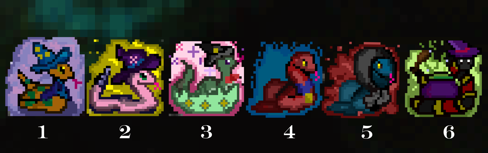
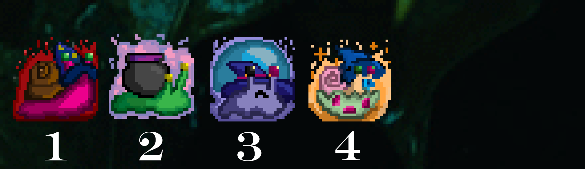

#Snizard vs. Snizard: Age of Snwarfare 
#A Design Plan.

#Introduction

The basic idea behind the game is a scrolling platformer in which a player tries to reach one end of each level by building platforms that take the player from one end to the other while killing all enemies. 

The premise is that there are two rival wizarding clans: the Snizards, and the Snizards. The Snizards (snake wizards) hate the snizards (snail wizards), but they cannot kill each other directly; according to some ancient wizarding rule, wizards can’t kill each other directly. They have to use traps and the environment to eliminate each other. The player can choose which wizard clan to join, the Snizards or the Snizards, and then can level up their first avatar, or as they advance, scoring points and finding coins, can unlock other snizards to play as, each with their own unique abilities--snail wizards or snake wizards depending on which clan they joined. 

###Gameplay Structure

The game is based on this premise. At first, the user is taken to the main menu, in which they can login and access any of three different campaigns (allowing the player to both play as either snizard or snizard); from there, if this is their first time, they are taken to a cutscene explaining the premise, or they can go to level directory and choose a level. 

The gameplay is as follows. The player needs to think strategically: their objective is to reach the flag icon at one end of the level while making sure all enemies don’t. First is the BLUEPRINT stage. In this stage, the user is able to see the complete level at once, and is shown a BANK of objects they can insert into the map to accomplish their objective. Some objects are simple platforms to help the user reach the end; others are hazards that can kill either the player or their enemies. The player also has a personal INVENTORY of objects that they can hold onto during both the gameplay stage and across levels, so even if a necessary object does not spawn during the BLUEPRINT stage’s BANK, they can still solve the puzzle.

Once the player is satisfied by their BLUEPRINT of the map, the GAMEPLAY stage begins. The user clicks play, and their snizard avatar spawns on the map they have designed, following by any number of artificial enemies. There are six possible snizards for each snizard clan; depending on the player’s initial choice, they ‘play’ against the opposite team. In the first levels, the player plays against one or two relatively “dumb” snizards that simply follow the player until the player manages to kill them. 

In this gameplay stage, there are two win conditions. First, the player must navigate their level without dying, an increasingly difficult objective as the game advances and the objects that spawn in the BANK become populated more and more with more hazards and less platforms, and as the maps get more and more sparse. Second, the player must kill the rival snizards, which will spawn in increasing numbers and with increasing abilities. No snizard can kill another snizard directly, but they can manipulate the environment with projectiles, object-destroying abilities, and other hazards. 

If the player fails one of the win conditions, they are taken to a REPLAY stage that shows them where they failed; if the player succeeds in both objectives, they see a victory screen and can either move onto the next level or go back to the level directory. The game is over when all levels are beaten, but at that point the player can unlock the FREEPLAY  option in which the player can make their own levels over successive rounds and choose which enemies spawn. 

Please refer to the wire frames below for the game layout.

The primary architecture of the design is as follows.  

###Data Management

User data management:
A .txt file that stores username and password, inventory up to six spaces, high score per level, available coins, unlocked characters, unlocked levels, and saved level layouts.
Level Data:

Each level requires the following data files:
- A .json text file that records the initial map layout of the file, including the address of the map background images (light and dark versions) in the first line, and then in a CSV format the name of the object, the x and y position, and the length of the object in relation to this x and y coordinate. An example is : “brick” (2;3) 3,. The brick is 3 “tiles” long. 
- An empty .json text file that the back end will write based on how the user places objects in the map in the BLUEPRINT stage, in the same format.
- A .json text file that saves the address to at maximum three other .json file locations that store level layouts of this same level--in other words, if this player has tried other configurations of this level before, they can pull these saved files here.
- A .json file that will hold the player’s position in pixels for the replay function after the game is won or lost. 

The files are in addition to the files needed to render the images of the avatars, enemies, and object sprites. 

Thus, in these stages:

####Blueprint stage
- In the back end, once a level is selected, the game will ask the LevelBuilder module to read the csv file associated with the level for the LevelRenderer module to assemble. The LevelRenderer will curate the images of avatars, enemies, and object sprites and make a basic map, and pass a root (Pane) of objects off to the BLUEPRINT class, which will add an affine grid and call the BankBuilder to assemble a Bank. The BankBuilder will read the Bank .json file associated with the level and curate a BANK of objects the user can insert into the map at will. The BLUEPRINT class will display this in the View.  
- In the BLUEPRINT stage, the user can click and drag from the BANK assembled by the BANK class based on information from the BankBuilder; when an object is placed on the map as shown by the BLUEPRINT class, this decision is conferred to the LevelWriter class, which writes a csv based on this input. When the player has used all the items from the BANK or is otherwise satisfied, they can press play, at which point the LevelWriter will send the complete CSV file to the LevelBuilder for the next stage.
####Gameplay Stage
- The LevelBuilder will read this csv and pass these findings to the LevelRenderer, which will assemble the map for the player to see. As the player moves, their position is recorded in a csv file by LevelWriter every 1/60th of a second.  
- The PlayLevel module will spawn the player and handle their inputs, letting the user control where in the map they go and how they interact with the objects. The PlayLevel module will call on the SpawnSnizard module, which spawns artificial enemy snizards and controls their movement on the map.
#### Replay Stage
The Replay module will read the csv file written by the LevelWriter to learn where in the level the user has travelled; it will recreate this movement for the user to reflect on after winning or losing.

# Overview
This section serves as a map of your design for other programmers to gain a general understanding of how and why the program was divided up, and how the individual parts work together to provide the desired functionality. Describe specific modules you intend to create, their purpose with regards to the program's functionality, and how they collaborate with each other, focusing specifically on each one's API. Include a picture of how the modules are related (these pictures can be hand drawn and scanned in, created with a standard drawing program, or screen shots from a UML design program). Discuss specific classes, methods, and data structures, but not individual lines of code.

Like the OOGA project overview recommends, our program is divided between the Engine, Data, and the Player.

Frontend
Viewer (main frontend class)
Button classes (user by the viewer)
Input/Output
Load and same level states
Save player data
Backend
Immutable Objects API (objects that the user cannot change)
Platforms, traps, etc.
Includes interactions between objects
Mutable Objects API (objects that the player places)
Store
Controller/Engine
Game flow features (e.g. pause, play, follow character feature)
Updates the viewer based on backend methods

The Player Class has its own image, Score, Location, Lives
Personal high scores, preferences (e.g., name, password, age (if parental controls are implemented), and favorite variants, tokens, colors, etc).

## Engine Package
###Game Objects
An object in the Game is added through the GameObject interface, which implements the basic Java Object. When GameObjects collide, they call upon the Interactions interface. The Interaction interface is implemented by the Game abstract class, which is extended by the Game child objects. 

A GameObject needs to be able to load in images and occupy a space on the Game display. Here is a basic hierarchy of GameObjects in the game, which will be expounded upon in greater detail later. 

- GameObject Class
    - Platform Class (defined by the fact the player cannot pass through it)
        - Hazard Class 
            - (boolean, if you touch it (or its projectiles touch you), death/lose a life)
        - Moving Platform Class
        - Appendable Class 
            - (does not occupy a tile space, but can be added to an object)
            - PlayerAppendableAffect Class
                - Example: Ice or Glue, which affect how a player moves through the object
            - PlayerAppendableHazard
                - Example: Barbed wire, which kills the player.
    - Enemy Class
        - They follow by some distance, follow different levels of intuition
            - Level 1: Follows 20 pixels
            - Level 2: Take the path you took exactly
            - Level 3: Take the path you took when you died last (?)
            - Level 4: Anticipates your moves, or moves you need to take
        - BASIC ABILITIES of Enemies
            - JUMP
            - WALK 
            - RUN
            - EXTRA ABILITIES
                - PROJECTILES
                - FLY
                - DOUBLE JUMP
    - Power-up Class (objects that the user can pick up, and thus disappear after use)
        - Example: Potions
    - PlayerAvatar Class
        - BASIC ABILITIES within PlayLevel
            - WALK
            - RUN
            - JUMP
            - EXTRA ABILITIES (based on which snizard player unlocks)
                - PROJECTILES (up to 5)
                - Special abilities (mentioned below)
        - PlayerAvatar extends GameObject, BUT the user's information, the Player package, is different.
## Data Package

##Player

##Modules

- Replay Feature
-  Follow character feature
- Control Enemy Plan feature
- Player interactions
- Build map
- Choose platforms for user based on the level what platforms to give the player
- Choose Player Menu
- Player Information Stage
    - See user's information, chosen Avatar, High Score, how much money available
- Main Menu
- Store
    - pay for new abilities/skills/players/levels with coins earned in game.

###Point System

Earn points by killing enemies (capped at maximum number of enemies killed in level),
and by completing objectives, like reaching a certain point, opening chests, killing a snizard's minions (scarabs).
Breaking blocks also gets you points. Earning points is NOT the same as collecting coins, which you can spend in store;
that way, you can reach a new high score for a level and compete against other players for high scores in a level, but
it's not as important if you want to advance. There is also a best time feature shared in a global high score sheet for 
fastest completed level. 

MAIN MENU -->CUSTOMIZABLE MENU →CHOOSE LEVEL PHASE -->BANK PHASE: Player gets six or seven objects they can put in the level→ BLUE PRINT PHASE : Player can build their level→PLAYABLE PHASE: Player plays their level→
REPLAY PHASE: (If they die) you can see a replay

# Example games
The complexity to this game comes from its customization. From the get-go, the user must choose between two clans, each of which have their own advantages and disadvantages. A snake wizard cannot go near a snake charmer; a snail wizard can be killed by salt, but a snail wizard ignores a snake charmer and a snake wizard ignores salt. Each playable character has special abilities, and all can use potions as they acquire them. The player also builds their own levels, and the game must have a developed enough data management program to save and access these levels again later, in addition to a robust inventory system. Thus, the Player package must be significantly advanced to accommodate for these vulnerabilities, which change as the user changes characters, gets money, builds levels, etc.

Equally, the objective of the game is not only to build a level the player can navigate, but to build a level the artificial enemy snizards cannot navigate. 

##Playable Characters:
###Snake Lineup:
1) Shadow Snake--Able to disappear from enemies’ view
2) Fire Snake: Shoots fire (pictured below)
3) Garden Snake: Grows climbable vines (pictured below)
4) Teleporting Snake: Baby snake
5) Exploding Snake: destroys one enemy within its radius
6) Speedy Snake: moves super fast
7) UNLOCKABLE SNAKE: King Cobra

Please refer to the following sprites for the above snake lineup.

Full snake lineup (NUMBERS DIFFERENT FROM ABOVE): 1 (Fire snake), 2 (garden snake), 3 (baby/teleporting snake), 4 speedy snake, 5 shadow snake, 6 exploding snake

Ideally we will have different "states" for the characters, like whether they are falling, attacking, jumping, what-have-you,
with different animations accordingly.

###Snail Lineup (incomplete)
1. Fire Snail (Shoots fire)
2. Ink Snail (leaves trails of ink, makes them slow)
3. Crystal Ball Snail: Shoots beams of light
4. Baby snail  (freezes enemies in place with cuteness)
5. Zombie snail (extra life)
6. Ghost snail (passes through a set amount of tiles)
7. UNLOCKABLE SNAIL: The Slug

Note: missing the zombie snail and garden snail from this image. Making pixel art is hard.

####Note on Minions
If we have enough time, we may implement minions, which would have a similar role as 
a turtle from Super Mario, walking aimlessly. They would shoot projectiles and be relatively "dumb", 
and killing them would be optional for the player.

- Minions (do not move, but shoot projectiles):
    - Snakes have scarabs as minions (gold)
    - Snails have beetles (black)

####A Full List of GameObjects in the Game
- In built parts of a level BEFORE a user adds input in the BLUEPRINT stage:
    - Water tile
        - players _cannot swim_. Kills player instantly.
    - Earth tile
        - players can walk on this.
    - Tree tile 
        - players cannot jump over them without help from platformers.
    - Flag (marks end of level/level objective)
        - players cannot move or add things within 32 pixels of this flag.
        - once player has reached the flag, the Gameplay stage is over.
    - spawn location (denotated by an icon)
        - players cannot move or add things within 32 pixels (one character length) of this flag.
- Stable objects (added by player)
    - Fan 
        - (catapult character forward)
    - Vending machine 
        - player can spend a coin here to get a random potion.
    - Vines 
        - player can climb this. 
- Appendable objects:
    - PlayerAppendableAffect
        - Ice 
            - makes surface slippery, causing player to move x2 faster.
        - Glue
            - glue makes player x2 _slower_ AND glue can be added between two objects to stick them together.
    - PlayerAppendableHazard
        - Spike
            - kills player instantly.
        - Salt 
            - kills snails wizards instantly; _does not affect snakes_
- (Optional) Minions:
    - Fire beetles/scarabs: shoot fire
    - Water beetles/scarabs: send waves of water
    - Note: Snakes get scarabs (gold beetles);
            Snails get beetles (black beetles)
- Projectiles:
    - Potion throwers: a catapult that throws potions at a parabolic angle
    - crossbow: shoots arrows in a straight direction.
- Hazards: 
    - Snake charmer ( a stable object )
        - distracts snakes and keeps them immobilized for 15 seconds unless player pays them a coin.
            - if the snake distracted is a NPC (i.e. a rival snizard), the immobilization is endless.
        - snake charmers do not affect snail wizards.
    - Venus fly trap ( a stable object )
        - this hazard eats snakes and snails if character enters within its range.
    - Vat of minions: player steps on it and falls into vat, dies
- Movable objects:
    - Witch broomsticks: move side to side
    - Levitating platforms: move up and down
    - Conveyer belts: a platform that if a character stands on it, moves them slowly to the side. 
    - Cauldron: snail/snake hops in, can catapult to other side of map

#Design Considerations
This section describes any issues which need to be addressed or resolved before attempting to devise a complete design solution. Include any design decisions discussed at length (include pros and cons from all sides of the discussion) as well as any ambiguities, assumptions, or dependencies regarding the program that impact the overall design.

